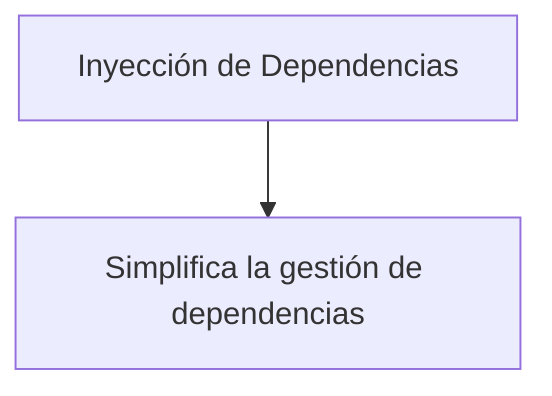

# Introducción a Spring Framework

## ¿Qué es Spring?
Spring es un framework para el desarrollo de aplicaciones Java, que proporciona infraestructura de soporte para desarrollar aplicaciones robustas y de alta calidad. Es especialmente popular en el desarrollo de aplicaciones empresariales.

### Historia de Spring
Spring fue creado por Rod Johnson en 2003, y desde entonces ha evolucionado para incluir una amplia gama de características y herramientas para facilitar el desarrollo de aplicaciones.

## Ventajas de Spring

1. **Inyección de Dependencias (DI)**: Simplifica la gestión de dependencias y promueve un código más modular y fácil de probar.
2. **Programación Orientada a Aspectos (AOP)**: Permite separar las preocupaciones transversales (como la seguridad y el logging) del código de negocio principal.
3. **Gran Ecosistema**: Cuenta con una gran cantidad de proyectos complementarios como Spring Boot, Spring Data, Spring Security, entre otros.
4. **Comunidad Activa**: Tiene una comunidad muy activa que contribuye con documentación, herramientas y soporte.

